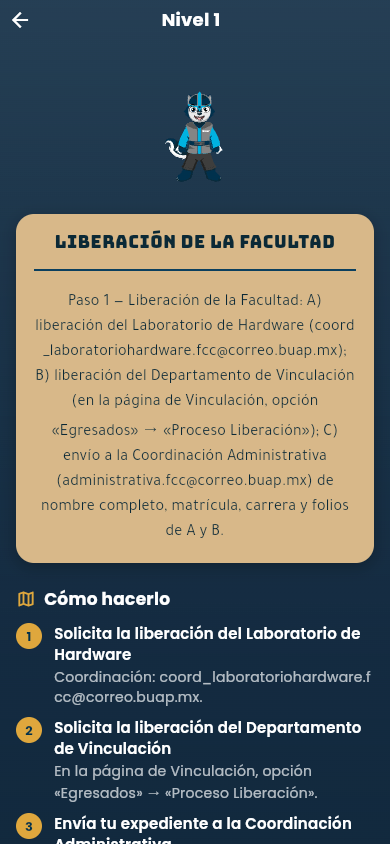
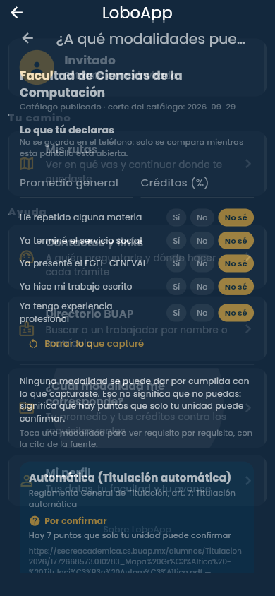
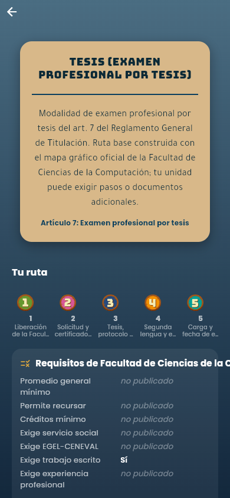
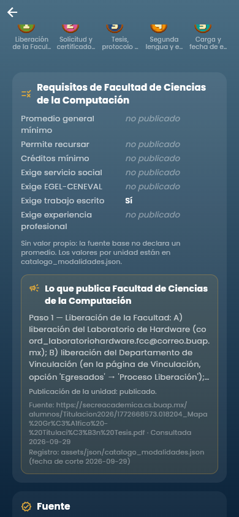
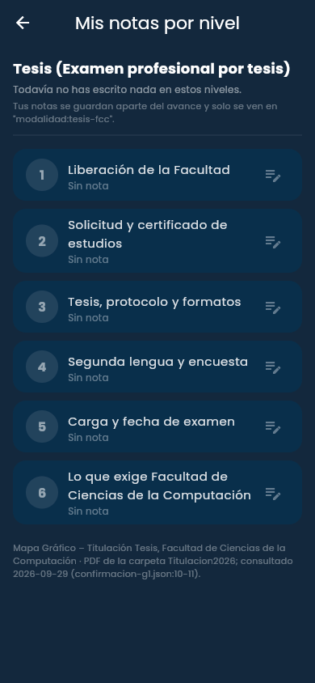
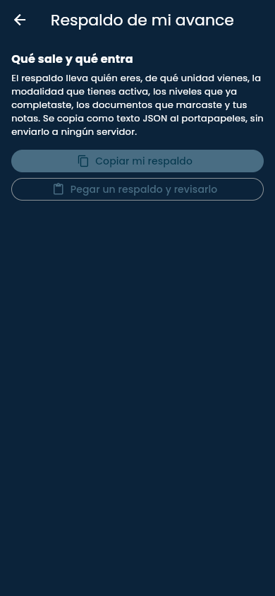

# 🐺 LoboApp

<p align="center">
  
</p>

<h3 align="center">Tu titulación en la BUAP, como una aventura</h3>

<p align="center">
  <a href="https://github.com/MadManJohnSmith/LoboApp/releases/latest"></a>
  <a href="https://github.com/MadManJohnSmith/LoboApp/actions/workflows/ci.yml"></a>
  
  
  
</p>

**LoboApp** acompaña a los alumnos de la [BUAP](https://www.buap.mx) durante su
proceso de **titulación**: eliges la ruta de titulación que te corresponde,
avanzas por un mapa nivel por nivel, y cada nivel te explica exactamente qué
trámites hacer, qué documentos pedir y a quién acudir.

Funciona **100% sin conexión y sin cuenta**: tu progreso se guarda únicamente
en tu dispositivo.

<p align="center">
  🌐 <a href="https://madmanjohnsmith.github.io/LoboApp/"><strong>Pruébala en el navegador</strong></a>
  &nbsp;·&nbsp;
  ⬇ <a href="https://github.com/MadManJohnSmith/LoboApp/releases/latest"><strong>Descarga la app completa</strong></a>
  <br/>
  <sub>La demo web es una versión de muestra sin buscadores; la app completa
  se publica en Releases.</sub>
</p>

---

## 📱 Capturas

| Elige tu ruta | Avanza por el mapa | Completa cada nivel |
|:---:|:---:|:---:|
|  |  |  |

| ¿Cuál me corresponde? | Tu ruta, con sus requisitos | Cada dato con su fuente |
|:---:|:---:|:---:|
|  |  |  |

| Tu unidad, ya precargada | Anota lo que te falta | Tu avance, con respaldo |
|:---:|:---:|:---:|
|  |  |  |

<p align="center">
  <br/>
  <em>Tu perfil guarda la facultad elegida y el avance de cada modalidad que
  publica tu unidad.</em>
</p>

## 🗺️ ¿Cómo funciona?

1. **Entras con tu matrícula** (o como invitado) — la app te busca en la base
   de alumnos de la BUAP y toma tu nombre.
2. **Eliges tu unidad y tu ruta de titulación** — las 34 unidades académicas
   están precargadas, y hay 8 rutas: **promedio**, **CENEVAL**, **examen
   profesional** y las cinco modalidades del art. 7 del Reglamento General de
   Titulación (tesis, memoria de experiencia profesional, diplomado,
   seminario por convocatoria y asignatura optativa con créditos).
3. **Recorres el mapa** — cada isla es un nivel de tu trámite, desbloqueado
   en orden, con tu mascota lobo avanzando contigo. Cada nivel te explica los
   pasos uno por uno y los documentos los vas marcando como recogidos; al
   terminar todos los niveles, tu expediente está listo.
4. **Si no sabes cuál te toca** — el apartado *«¿Cuál modalidad me
   corresponde?»* compara tu promedio y tus créditos contra los requisitos
   que publica tu unidad y te dice qué se cumple, qué no y **qué no se puede
   confirmar** con lo que capturaste. Nunca decide por ti: cada respuesta
   trae el enlace oficial y la fecha con la que se comparó.

## ✨ Características

- 🎮 **Gamificado**: rutas, niveles, mascotas y mapa — el trámite deja de ser
  un laberinto de PDFs.
- 📋 **78 documentos y 86 pasos** en 50 niveles, explicados en lenguaje claro.
- 📑 **Catálogo por unidad**: 137 modalidades registradas de 34 unidades, cada
  una con su fuente oficial y su fecha, dentro de las ocho modalidades que
  reconoce el Reglamento General de Titulación (art. 7, H. Consejo Universitario
  23-nov-2015).
- 🏛️ **Las 34 unidades académicas** con su coordinación de titulación.
- 🔍 **Buscador de matrícula offline** sobre 318,374 alumnos: la base va
  comprimida dentro de la app y solo se descomprime la cohorte que toca.
- 📇 **Directorio BUAP**: búsqueda de 43,025 trabajadores por nombre o
  matrícula.
- ☎️ **Contactos y enlaces útiles**: DAE, CGAU, trámites en línea.
- 🧮 **Calculadora de elegibilidad**: tu promedio y tus créditos contra los
  requisitos reales de cada modalidad de tu unidad, con «por confirmar» donde la
  unidad no publica el dato.
- 🗒️ **Tus notas y tu respaldo**: anotas lo que falta y exportas/importas tu
  avance en un archivo, para no perderlo si cambias de teléfono.
- 🔒 **Privado por diseño**: sin servidor, sin cuenta, sin analítica. Nada
  sale de tu teléfono. [Detalles de privacidad](docs/PRIVACIDAD.md).

## 📲 Instalación

Todas las versiones se publican en la página de
[**Releases**](https://github.com/MadManJohnSmith/LoboApp/releases).

### Android (recomendado)

Descarga el APK más reciente (`LoboApp-x.y.z-android-arm64.apk` para
teléfonos modernos, `armv7` para equipos antiguos), ábrelo en tu teléfono y
acepta la instalación (necesitas permitir "instalar apps de fuentes
desconocidas" la primera vez).

### Windows

Descarga `LoboApp-x.y.z-windows-x64.zip`, descomprímelo donde quieras y
ejecuta `LoboApp.exe`. No requiere instalación.

### macOS

Descarga `LoboApp-x.y.z-macos.zip`, descomprímelo y arrastra `LoboApp.app` a
Aplicaciones. Como la app no está firmada con certificado de Apple, la
primera vez haz clic derecho → **Abrir**.

### Linux

Descarga `LoboApp-x.y.z-linux-x64.tar.gz`, descomprímelo y ejecuta
`./bundle/LoboApp` (requiere GTK 3, que cualquier escritorio moderno trae).

### Web

No requiere instalación: usa la
[demo en el navegador](https://madmanjohnsmith.github.io/LoboApp/), o
compílalo tú (pasos abajo).

### Compilar desde el código fuente

Necesitas [Flutter](https://docs.flutter.dev/get-started/install) 3.47 o
superior (y Android SDK solo si quieres el APK):

```bash
git clone https://github.com/MadManJohnSmith/LoboApp.git
cd LoboApp
flutter pub get
flutter run -d chrome            # web
flutter run -d windows           # (o macos / linux)
flutter build apk --release      # Android → build/app/outputs/flutter-apk/
```

Para verificar que todo está en orden:

```bash
flutter analyze   # No issues found!
flutter test      # todas las pruebas, incluidas de integridad de datos y assets
```

## ❓ Preguntas frecuentes

**¿Funciona sin internet?**
Sí. Las rutas, el catálogo de modalidades y las bases de búsqueda viajan
dentro de la app, y tu progreso se guarda en tu dispositivo. Solo la demo
web corre en el navegador.

**¿La app decide qué modalidad me toca?**
No. La calculadora compara tu promedio y tus créditos contra los requisitos
que publica tu unidad y te dice qué se cumple, qué no y qué no se puede
confirmar con lo que capturaste, siempre con el enlace oficial y la fecha al
lado. La decisión final es tuya.

**¿De dónde salen los requisitos?**
De lo que cada unidad académica publica: cada modalidad cita su fuente
oficial con el enlace y la fecha, y donde tu unidad no publica requisitos la
app dice «no publicado» en vez de rellenar. El catálogo completo vive en
[`assets/json/`](assets/json).

**¿Cambio de teléfono y pierdo mi avance?**
No: exportas tu respaldo a un archivo y lo importas en el nuevo teléfono.

**¿Por qué la demo del navegador no tiene buscadores?**
Porque las bases de alumnos y trabajadores solo viajan dentro de la app
instalada, nunca como archivos descargables en la web.

## 🔒 Privacidad

- No hay servidor ni cuenta: todo el progreso vive en `shared_preferences`
  locales del dispositivo.
- La base de alumnos incluida contiene **solo matrícula y nombre** — se
  quitaron todos los correos de alumnos, y de los trabajadores solo se
  conservan los correos institucionales `@correo.buap.mx`.
- La demo web del navegador **no incluye las bases** (por eso sus buscadores
  están desactivados): el padrón solo viaja dentro de la app instalada, nunca
  como archivos descargables.
- El proceso completo de decisión y cómo quitar las bases si la BUAP lo
  solicita está documentado en [docs/PRIVACIDAD.md](docs/PRIVACIDAD.md).

## 🛠️ Cambiar el contenido (sin programar)

**Toda la información de la app vive en `assets/json/`** — nada está
hardcodeado en el código:

| Archivo | Contenido |
|---|---|
| `routes.json` | Las 8 rutas: niveles, pasos, documentos y particularidades por unidad |
| `facultades.json` | Las 34 unidades académicas y sus contactos |
| `catalogo_modalidades.json` | Las 137 modalidades con su fuente oficial y su fecha |
| `links.json` | Enlaces útiles de la BUAP |
| `contactos.json` | Contactos generales (DAE, CGAU) |

¿Cambió un requisito, un costo o un teléfono? Se edita el JSON y la app se
actualiza. ¿Tu facultad no tiene correo publicado? Mándalo con su fuente
oficial vía [issue](https://github.com/MadManJohnSmith/LoboApp/issues) y
se agrega.

## 🧱 Estructura del proyecto

```
lib/
  main.dart                  raíz: bienvenida ↔ home
  theme.dart                 paleta y tipografías (Poppins, Bungee, Tajawal)
  models/models.dart         Ruta, Nivel, Paso, Documento, Facultad, Alumno,
                             UnidadCatalogo, ModalidadUnidad, Elegibilidad
  state/app_state.dart       estado + persistencia local del progreso
  services/                  repositorios: contenido JSON, alumnos, trabajadores
  screens/                   las 13 pantallas de la app
  widgets/                   componentes reutilizables
tools/                       script para regenerar las bases desde los .db
docs/                        privacidad, pendientes, decisiones de diseño
```

## 🚦 Estado del proyecto

La app está **completa y lista para despliegue**: cada tag (`v1.1.0`, …)
dispara una compilación automática para Android, Windows, macOS y Linux que
se publica sola en Releases, y cada cambio en `main` actualiza la demo web.
Cada push pasa por el CI: `flutter analyze` sin incidencias, `flutter test`
con 116 pruebas en verde, y web y APK compilan. Lo que queda depende de la
BUAP: confirmar algunos textos del diseño original, completar los correos de
titulación que no están publicados, recuperar el catálogo de las 9 unidades que
no lo publican y la firma de release para Play Store. Detalles en
[docs/PENDIENTES.md](docs/PENDIENTES.md).

## 🤝 Contribuir

Issues y pull requests son bienvenidos — lee
[CONTRIBUTING.md](CONTRIBUTING.md) primero. En especial se agradece ayuda para
**verificar información oficial de la BUAP**.

## 📄 Licencia

El código es público **solo para consulta**: todos los derechos reservados —
no se permite su copia, reutilización ni distribución sin autorización
escrita. Ver [LICENSE.md](LICENSE.md).
